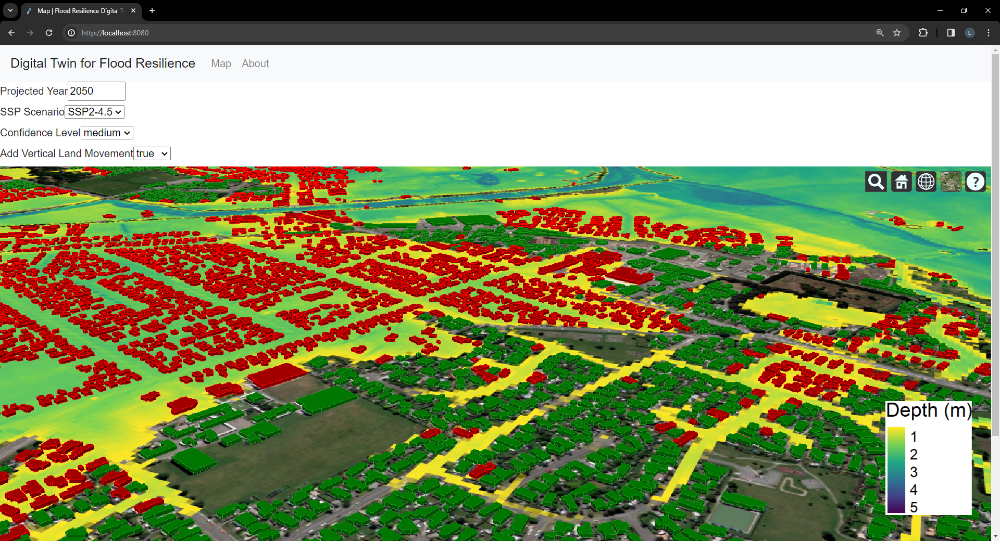

Copyright © 2021-2026 Geospatial Research Institute Toi Hangarau

# Environmental Digital Data Intelligence Engine (EDDIE)

A core software framework for creating analytical digital twins with automated environmental/geospatial data gathering,
caching, updating, and processing.
Modular plugins are developed to allow for complex models to be run on-demand, with all input data fetched
automatically. This project started as the Flood Resilience Digital Twin (FReDT), which has now been split off into
[its own project](http://github.com/GeospatialResearch/eddie_floodresilience) while this contains the framework that
FReDT is built upon.

EDDIE is used as the core framework for multiple environmental Digital Twins and data visualisation applications,
including:

- [Te Awarua Kai Ora](https://teawaruakaiora.co.nz)
- [Flood Resilience Digital Twin](https://fredt.geospatial.ac.nz) (FReDT) -
  [GitHub](https://github.com/GeospatialResearch/eddie_floodresilience)
- [Ōtākaro Digital Twin](https:?/geospatial.ac.nz/research/projects/otakaro-digital-twin/)
- [Carbon Neutral Neighbourhoods Dashboard](carbon-neutral.app.geospatial.ac.nz)

<!-- See our [draft paper for Journal of Open Source Software](paper/paper.pdf) for more details. -->

## Basic running instructions

To use the library you must install it and use it as a framework within an application.
Currently the best way to do this is by pip installing this github repository. Examples of using the library are best
found within the [FReDT repository](https://github.com/GeospatialResearch/eddie_floodresilience). We aim to expand
usage documentation in the near future.

### Unsupported Operating Systems

We unfortunately do not support MacOS. Please see [#358](/../../issues/358) for updates or to contribute.

## Contributing

If you are interested in contributing to this project, please see [our contributing page here](CONTRIBUTING.md).

## Support

If you run into an issue, bug, or need help with the software, please consider opening an issue or discussion, this will
be the best way to reach us.

## Setup for FReDT project software developers

[Visit our wiki](https://github.com/GeospatialResearch/Digital-Twins/wiki/) for some instructions on how to set up your
development machine to work with on the FReDT project.
