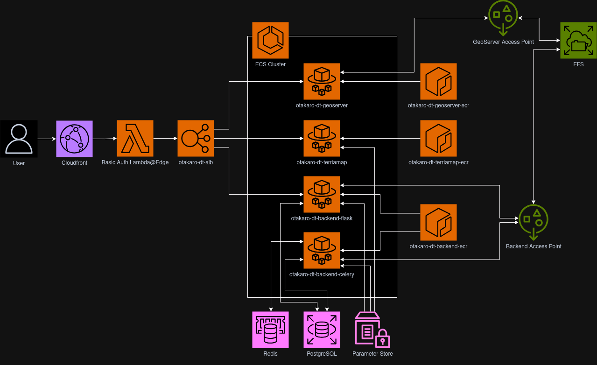

# Otakaro AWS deployment 

This documentation covers the deployment of the [Otakaro Digital Twin](https://otakaro.digitaltwins.nz/) to AWS.

This directory contains a set of files that comprise a [Pulumi](https://www.pulumi.com/) deployment.

All of the configuration is written in Python so as to reduce the overhead in bringing a developer up to speed with making changes to configuration where necessary.

The modules in this repository can best be summed up as such:

 - `__main__.py`: This is where the bulk of the config happens, pulling in modules as required and contains a lot of the configuration. If you're not deploying new services, this file is where you'll spend most of your time.
 - `efs.py`: Creates [Amazon EFS](https://aws.amazon.com/efs/) file shares. These get mounted to services as NFS shares.
 - `alb.py`: Creates an [Amazon Application Load Balancer](https://docs.aws.amazon.com/elasticloadbalancing/latest/application/application-load-balancers.html) for routing requests to ECS services.
 - `certs.py`: Automates the creation of HTTPS certificates with Amazon as the CA.
 - `postgres.py`: Creates [Amazon RDS](https://aws.amazon.com/rds/postgresql/) instances, specifically PostgreSQL.
 - `cloudfront.py`: Sets up [Amazon CloudFront](https://aws.amazon.com/cloudfront/) Distributions. This can also set up Basic Authentication as a [Lambda@Edge](https://aws.amazon.com/lambda/edge/) function.
 - `fargate.py`: Set up everything required to run an instance of a container in [ECS Fargate](https://docs.aws.amazon.com/AmazonECS/latest/developerguide/AWS_Fargate.html). This sets up a container repository, a lambda function to update the image tag, necessary Security Groups and a ECS Fargate service running the specified container.
 - `backend.py`: Specifically sets up all of the extra resources that the Otakaro Digital Twin backend requires. Stands up 2 ECS Services (Celery Worker + Flask API Server) and a Redis instance to handle Message Queueing and Brokering.

## Getting Started

To get started it's assumed you have access to a Linux command line in some way shape or form (i.e WSL2 or Linux. If you're using a Mac that's basically Unix.)

### Installing Pulumi
The instructions can be [found here](https://www.pulumi.com/docs/iac/download-install/).

Once that's done you should be able to do something like this in a terminal. (The version will probably be newer for you)
```
 $ pulumi version
v3.137.0
```

### How Pulumi Manages State
Pulumi uses a state file to keep state, and you "log into" a Pulumi backend. 

For this codebase assume we're using an S3 bucket as our backend, because we're already in an AWS environment anyway.

If you want more information, it can be [found here](https://www.pulumi.com/docs/iac/concepts/state-and-backends/).

### Setting up Pulumi 

For this we're going to assume we're using the current Otakaro environment, but it's possible to remove 

For the Otakaro Digital Twin environment specifically, you're going to need a password. This has been provided to Luke Parkinson, so get it from him. 

Firstly, you need an active AWS profile in your environment, and you need to set it in your environment. 

This can be done with 
```
export AWS_PROFILE=[insert-profile-name-here]
```

Setting up an AWS Profile is beyond the scope of this documentation.

Next, you need to "log into" the pulumi state. For our purposes, the Otakaro bucket will be used as an example:
```
 $ pulumi login s3://otakaro-dt-pulumi-state
Logged in to vettel as alistairmcintyre (s3://otakaro-dt-pulumi-state)
```

Note that the bucket is PRIVATE, and was manually created through the console. This config shouldn't break it, and you will need a valid token at all times to make changes, which is good because you need access to start making changes!

### Updating AWS Resources 

This is as simple as running the following command inside the `deploy/otakaro` directory:
```
 $ pulumi up
```

You _might_ be prompted to pick a stack, use the arrows to move and select `production`

```
Please choose a stack, or create a new one:  [Use arrows to move, type to filter]
> production
  <create a new stack>
```

Next, you'll need to enter that password you got from Luke earlier:
```
Please choose a stack, or create a new one: production
Enter your passphrase to unlock config/secrets
    (set PULUMI_CONFIG_PASSPHRASE or PULUMI_CONFIG_PASSPHRASE_FILE to remember):  
```

Finally it'll give you a preview of changes:
```
Previewing update (production):
     Type                 Name                Plan     
     pulumi:pulumi:Stack  otakaro-production           

Resources:
    127 unchanged
```

You'll then have an interactive option to choose from yes, no or details.

`yes` will execute the changes, `no` will do nothing and abort, and `details` will give you detail about the changes you're trying to make.

## Pushing new images 

Updating a running ECS service is as easy as pushing a new image to the relevant ECR repository. These URLs get printed out at the end of the `pulumi up` run.

To log into the ECR service with Docker execute the following:
```
$ aws ecr get-login-password --region ap-southeast-2 | docker login --username AWS --password-stdin {ACCOUNT_ID}.dkr.ecr.ap-southeast-2.amazonaws.com
```

Then tag an image as `{ACCOUNT_ID}.dkr.ecr.ap-southeast-2.amazonaws.com/{image_repo_name}:{image_tag}`

Valid ECR Repo names are: (these replace the `image_repo_name` part)
 - otakaro-dt-backend-ecr
 - otakaro-dt-terriamap-ecr 
 - otakaro-dt-geoserver-ecr 


## Secrets
We have 2 types of secrets to manage. The Pulumi secrets are secret values required at deployment time, and the AWS Secrets are runtime secrets, required by each of the applications.

### Pulumi Secrets 
Pulumi Secrets are stored in the `Pulumi.production.yaml` file. This fine also contains some other configuration for the application.

Currently the only secret values stored in the Pulumi state are the Basic Auth credentials, and the default password for the PostgreSQL database. 

You can add a new secret like so:
```
 $ pulumi set --secret myKey Value
```

Then call it with `config.require_secret(key)` or `config.get_secret(key)` in the Python configuration.

### AWS Secrets 

In the `Pulumi.production.yaml` file you'll find a set of keys under the `otakaro:secretParameterNames` variable. Each of these secrets has been created in the AWS Parameter Store - you can see these variables [here](https://ap-southeast-2.console.aws.amazon.com/systems-manager/parameters?region=ap-southeast-2&tab=Table#).

Each of these has been initialized with a default value of `placeholder` and the value will be ignored after creation. This means that these parameters should be updated within the console by hand, and then the service restarted.

Once you've updated a secret in the Parameter Store, you'll need to restart the running service that depends on it. This could be automated but it's assumed these change so little there's no point in spending the time to get the script right.

You can restart a service by navigating to the ECS Console, selecting your cluster, and then opening up the service you want to restart. 

Once you're viewing that particular service, you should be able to select "Update Service" in the top right corner. Click on this. From here, check the box that says "Force new deployment" in this view and scroll down and hit "Update". 

This will force everything to reload and your new secrets should be in use once that deployment rolls out :)

## Otakaro Digital Twin (otakaro-dt) as-built (as of 27-Nov-2024)

NOTES: 
 - This is only in the context of this config. There may be code that creates additional connections (i.e GeoServer can technically connect to the Database)
 - Networking is excluded as it makes the diagrams much harder to follow.



## Caveats

These are small things that aren't automated for one reason or another

### Lambda Triggers aren't assigned automatically

When updating an image, the lambda's require a trigger to do this. We have the function, and the EventBridge config set up, but the actual connection isn't quite there.

These can be connected by:
 1. Opening the Lambda in the AWS Console 
 2. Clicking on "Add Trigger"
 3. Select "EventBridge (CloudWatch)" from the dropdown on the screen 
 4. Choosing "Existing Rule" and selecting the existing rule for that particular lambda (the service names should match)
 5. Clicking "Add".


